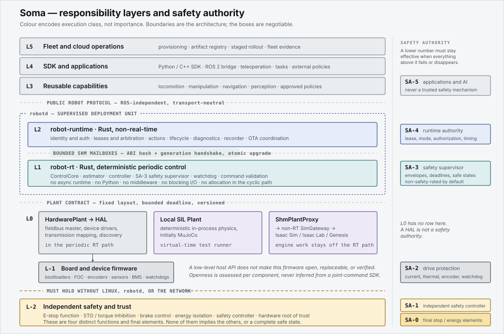
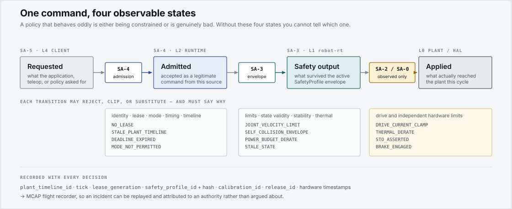
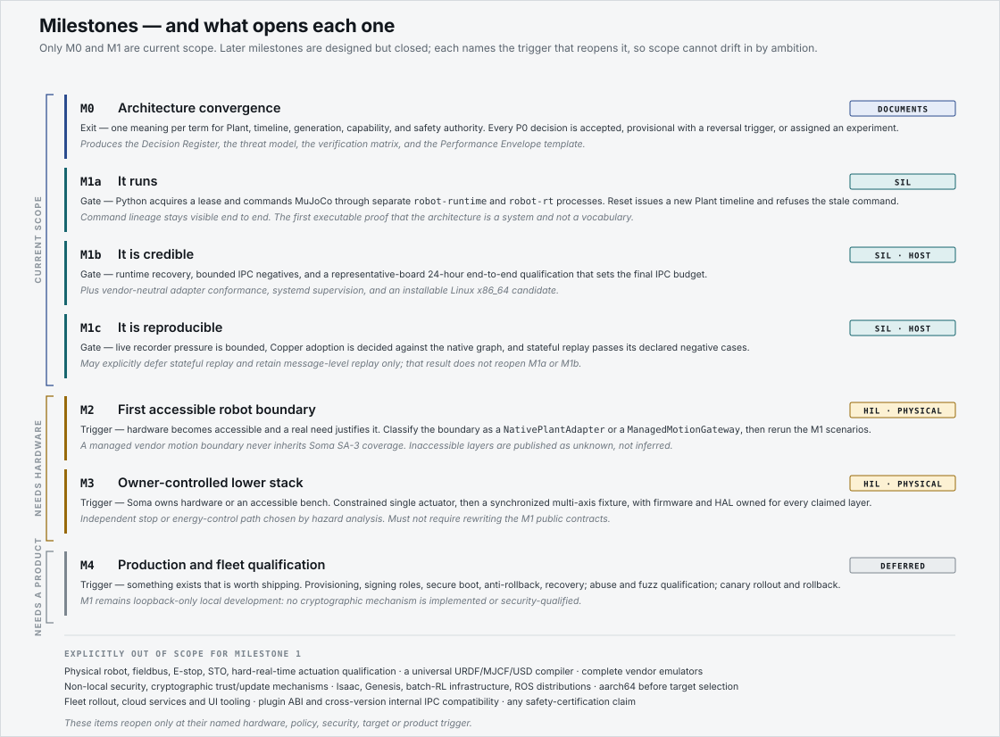
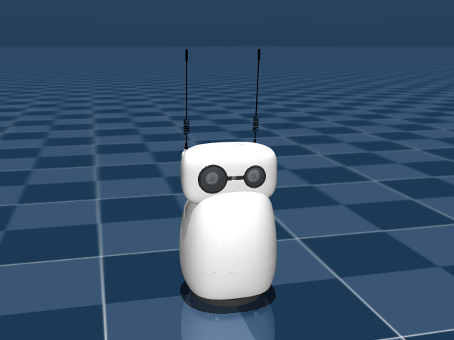

# Soma

**A system foundation for embodied intelligence.**

Soma is building a common software and systems foundation for Physical AI. The
active bootstrap is intentionally narrower: one fixed Reachy Mini profile in
MuJoCo and on Reachy Mini Lite hardware.

The project focuses on the layers beneath application intelligence: hardware abstraction, real-time control, runtime and communication, simulation, safety, deployment, observability, OTA, and ecosystem adapters.

> Many forms. One foundation.

## Architecture at a glance



Boundaries are the architecture; the boxes are negotiable. Colour encodes
execution class, not importance: grey is ordinary software, indigo the
non-real-time runtime, teal the deterministic control path, violet
simulation, and ochre the independent safety and trust path that must hold
without Linux, `robotd`, or the network.



A policy that behaves oddly is either being constrained or is genuinely bad.
Without these four observable states — requested, admitted, safety-output,
applied — you cannot tell which one, or who to hold responsible.



More diagrams and their relationship to the prose: [`docs/architecture/diagrams/`](docs/architecture/diagrams/).

## Reachy Mini simulation

The first executable Soma profile is Reachy Mini in MuJoCo. The same fixed
9-actuator command path drives the simulation, while Rerun exposes the
requested/measured state and event timeline as read-only evidence.

[](https://miaodx.github.io/soma/)

[Open the generated simulation report](https://miaodx.github.io/soma/) for the
motion video, downloadable Rerun recording, fixed-case comparison, and exact
commit provenance. The GitHub Pages workflow rebuilds the report from the
authoritative acceptance scenario on `main`; the committed poster keeps the
result visible before or between successful deployments.

The fixed Open Duck Mini v2 simulation has its own CI-generated report at
[Open Duck Mini status](https://miaodx.github.io/soma/open-duck/). It embeds the
Rerun web viewer and shows the two-run walk metrics; the `.rrd` recording remains
available as a download. Both reports are simulation-only and make no hardware
or physical-actuation claim.

Run the visual acceptance scenario locally:

```bash
cd python && uv sync && cd ..
scripts/run-sim-scenario --visualize
```

The paced scenario shows the initial pose, body-yaw and antenna motion, TTL
expiry to measured-position hold, a timeline reset, and rejection of an old
timeline. MuJoCo is the 3D view; Rerun is the observability view. The viewers
are observational only and cannot command, pause, step, perturb, or reset the
simulation.

For a terminal-driven demo, use `scripts/run-sim-teleop --visualize` and press
`A`/`D` for body yaw or `Q`/`E` for mirrored antenna nudges. The bounded,
non-interactive equivalent is:

```bash
scripts/run-sim-teleop --visualize --keys ADQE
```

To build and verify the same static report locally:

```bash
scripts/build-sim-showcase output/simulation-showcase
```

### What the dashboard proves

Rerun groups requested and measured positions into body yaw, six Stewart
motors, and two antennae. It also shows command TTL, state age, applied source,
rejection reason, plant health, timeline changes, and observer drop counters.
The typed state and scenario assertions remain the correctness oracle; viewer
pixels are supporting evidence.

### Simulation parity

The corrected fixed-case comparison reaches the same declared behavior as the
official Reachy simulation backend. These are simulation measurements, not
hardware claims:

| Case | Actuator | Soma RMS | Official RMS | Soma settling | Official settling |
| --- | --- | ---: | ---: | ---: | ---: |
| yaw-step | `yaw_body` | 0.018935 | 0.018948 | 80.062 ms | 80.067 ms |
| mirrored-antennas | `right_antenna` | 0.017362 | 0.017366 | 80.089 ms | 80.065 ms |
| combined-yaw-antennas | `yaw_body` | 0.018937 | 0.018950 | 80.098 ms | 80.082 ms |

See the [full cadence-correction report](docs/measurements/official-simulation-cadence-correction-report.md)
for all six actuator streams, repeatability evidence, and limitations.

## Status

The Reachy simulation path is executable. A thin Python client sends the fixed
9-actuator Protobuf command over loopback Zenoh to `robot-runtime`, which
bridges through a bounded local mailbox to `robot-rt` and the pinned MuJoCo
model. Native Lite work remains gated by the read-only N0 probe and physical
actuation authorization N1.

Run the complete simulation acceptance scenario:

```bash
cd python && uv sync && cd ..
scripts/run-sim-scenario
```

The first run downloads the pinned Rust and Python dependencies plus MuJoCo
3.9.0 and builds the robot runtime in release mode. The scenario proves state
delivery, actuator movement, command expiry to measured-position hold, reset
timeline change, and old-timeline rejection.

For an interactive simulation command session, run:

```bash
scripts/run-sim-teleop
```

Press `A`/`D` for discrete body-yaw nudges and `Q`/`E` for mirrored antenna
nudges. Each event sends one complete nine-position target with a 250 ms TTL;
the client does not continuously resend. Add `--visualize` for the same
read-only MuJoCo and Rerun views, or use `--keys ADQE` as the bounded
non-interactive integration route. `Ctrl-C` stops every process and removes
every socket owned by the command.

For the optional live simulation views, run:

```bash
scripts/run-sim-scenario --visualize
```

This installs the locked `rerun-sdk==0.36.2` visualization extra, starts its
viewer on an ephemeral loopback port, and opens both the MuJoCo model window and
a prearranged Rerun dashboard. The scenario is paced to show the initial pose,
yaw motion, TTL transition to measured-position hold, reset, and old-timeline
rejection. Closing either viewer does not stop the scenario or the other sink.

`robot-rt` and `ReachySimPlant` remain authoritative. MuJoCo receives a private,
lossy copy of the complete generalized state and cannot write back. Rerun reads
the existing public command/state topics plus that snapshot timing evidence; it
does not admit commands or invent a safety-output stage. Viewer pixels and rows
are observational evidence, while the typed state and scenario assertions are
the correctness oracle. Snapshot and Rerun queue loss is surfaced explicitly,
and raw `qpos`/`qvel` are intentionally not expanded into default dashboard
plots.
The Rerun `program_time` axis starts at observer launch (`0s`); producer and
receive timestamps are first aligned in the host monotonic clock domain and
then displayed relative to that common start, rather than as host uptime.

To inspect the windows after the acceptance scenario finishes, keep the visual
runtime alive until `Ctrl-C`:

```bash
scripts/run-sim-scenario --visualize --keep-open
```

Visual mode requires an active desktop display. For automated GUI startup
checks, `xvfb-run -a scripts/run-sim-scenario --visualize` is supported, but a
virtual display does not replace human review of motion readability, camera
interaction, or dashboard semantics.

With a powered Reachy Mini Lite connected, run the read-only N0 audit before
any hardware implementation or motion:

```bash
cargo run --bin soma-reachy-probe --
# Or select a reviewed device explicitly:
cargo run --bin soma-reachy-probe -- --device /dev/ttyUSB0
```

The probe never writes a register. It fails unless IDs 10 through 18 match the
pinned configuration, all torque states are disabled, the official daemon is
absent, and serial exclusivity is demonstrated.

## Design direction

- **Embodiment-independent core** — common contracts above hardware-specific HALs.
- **Rust-first systems stack** — Rust for the real-time core, robot runtime, and SDK client where practical.
- **ROS 2 at the edge** — ROS 2 is an ecosystem adapter, not a dependency of the robot core.
- **Simulation as a first-class backend** — MuJoCo, Isaac Sim/Lab, Genesis, SIL, and HIL participate in the same system contracts.
- **Production-shaped, evidence-led growth** — preserve the boundaries that are
  expensive to undo, and implement qualification, security, compatibility, and
  operations only when a concrete trigger exists.

## Documentation

- [Current status](STATUS.md)
- [Architecture map](ARCHITECTURE.md)
- [Human documentation index](docs/human/README.md)
- [Reference architecture](docs/architecture/reference-architecture.md)
- [Layering and trust boundaries](docs/architecture/layering-and-trust-boundaries.md)
- [Security threat model](docs/architecture/security-threat-model.md)
- [Glossary](docs/glossary.md)
- [Architecture decisions](docs/decisions/README.md)
- [Decision and research register](docs/plans/decision-register.md)
- [Bootstrap plan](docs/plans/bootstrap-plan.md)
- [Deep research index](docs/deep-research/README.md)

## License

[MIT](LICENSE)

---

*Soma* (σῶμα) means **body** — the physical embodiment through which intelligence acts on the world.
