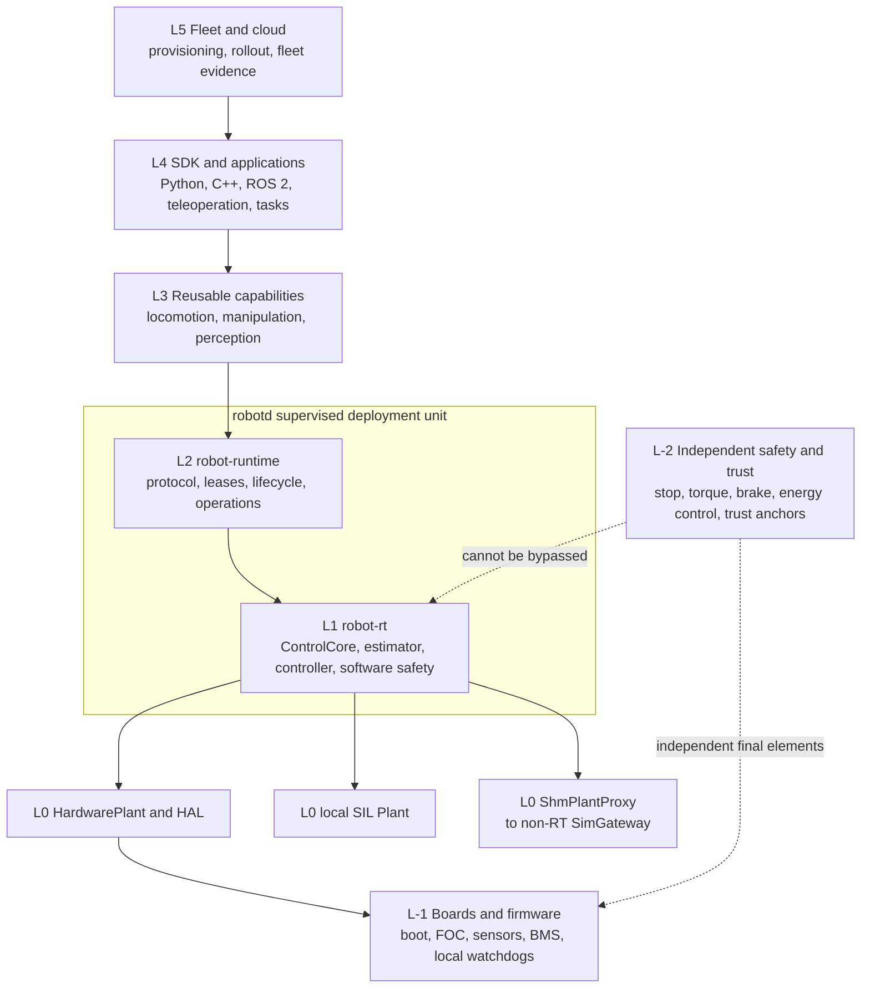
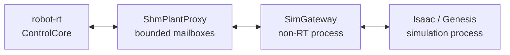

# Layering and Trust Boundaries

> Status: Canonical architecture. This document defines the names and ownership boundaries used by Soma. Deep-research documents may explore alternatives, but they should map their proposals onto this model before an ADR is accepted.

## Why two coordinate systems are required

Soma uses two independent coordinate systems:

- **`L-2` through `L5`** describe where product software and hardware responsibilities live;
- **`SA-0` through `SA-5`** describe safety authority and the order in which a higher-trust mechanism can constrain a lower-trust command source.

Safety authority is not another copy of the product stack. For example, a drive is implemented at `L-1`, but its over-current protection is `SA-2`; `robot-runtime` is implemented at `L2`, but its mode and lease checks are `SA-4`. Documents must not use unqualified names such as "Layer 2" for a safety authority.

## Canonical bottom-up layers

| Layer | Name | Owns | Does not own |
| --- | --- | --- | --- |
| `L-2` | Independent safety and trust | Independent stop, torque-inhibition, braking, and energy-control paths; safety controller; hardware root of trust; recovery trust anchors; production/debug enable policy | Linux application safety, ordinary device drivers, fleet policy |
| `L-1` | Board and device firmware | Device BSP/RTOS, bootloaders, secure boot measurement, motor-control/FOC loops, encoder acquisition, sensor firmware, BMS, local watchdogs and device fault state | Whole-robot estimation, distributed middleware, public SDK semantics |
| `L0` | Host BSP, HAL, and Plant adaptation | Host kernel/platform BSP, fieldbus masters, device discovery and drivers, transmission mapping, hardware capability inventory, `HardwarePlant`, simulation Plant adapters | Whole-body behavior, client arbitration, task semantics |
| `L1` | Deterministic control | `robot-rt`, scheduling, `ControlCore`, estimation required by the loop, controllers, command validation, software safety envelope, bounded RT evidence | Authentication, fleet communication, blocking I/O, arbitrary application code |
| `L2` | Robot runtime | `robot-runtime`, public Robot Protocol, identity/authentication, leases and arbitration, actions, lifecycle coordination, diagnostics, recording, OTA coordination | Independent stop/energy-control final elements, periodic bus I/O, user task logic |
| `L3` | Reusable capabilities | Locomotion, manipulation, navigation, perception, whole-body skills, approved policy execution, capability composition | Product-specific workflows and fleet rollout |
| `L4` | SDK and applications | Python/C++ SDKs, ROS 2 bridge, teleoperation, task graphs, developer tools, product applications and external policies | Bypassing runtime authority or lower safety authorities |
| `L5` | Fleet and cloud operations | Provisioning, artifact registry, staged rollout, fleet observability, remote support, data and training orchestration | Required local safety functions or hard-real-time control |

The layer number denotes responsibility, not necessarily a process, repository, CPU, or network hop. A product may package several adjacent layers together, but it must preserve the interfaces and failure containment implied by the table.

`L-2` groups foundations that must remain trustworthy when ordinary host software is compromised or unavailable. It does not claim that a cryptographic root of trust and a functional-safety controller are the same component, assurance argument, or certification boundary.

## Full-stack view



Cross-cutting contracts such as time, lifecycle, model identity, configuration, observability, security, OTA, and compatibility apply across several layers. They do not become a new vertical layer and must still identify the component that owns each decision.

## Safety Authority namespace

Soma uses the following names for the safety chain:

| Authority | Mechanism | Typical responsibility |
| --- | --- | --- |
| `SA-0` | Independent stop and energy-control path | E-stop input/function, torque inhibition such as STO, braking, and contactor isolation as distinct final elements |
| `SA-1` | Independent safety controller | Main-compute watchdog, safety-input monitoring, enable and reset sequencing |
| `SA-2` | Drive and device protection | Electrical, thermal, encoder-plausibility and local communication protection |
| `SA-3` | `robot-rt` Safety Supervisor | Deadline, state validity, joint/workspace, power, collision, stability and safe-behavior enforcement |
| `SA-4` | Runtime authority and mode policy | Lease ownership, mode permission, authorization and maintenance/developer gates |
| `SA-5` | Applications and AI | Command sources operating inside all lower authority constraints; not a trusted safety mechanism |

Lower-numbered authorities must remain effective when higher-numbered software fails or disappears, subject to the product's hazard analysis. `SA-0` and `SA-1` are intentionally outside the normal Linux control path. E-stop is a safety function, STO prevents drive-generated torque, a brake manages motion, and a contactor can isolate a power path; none of these terms is a synonym for the others or a complete safe state by itself. `SA-3` is protective software, not a safety-rated function by default. A product safety case decides which mechanisms are required, their integrity level, and their verified safe behaviors; the table does not by itself claim standards compliance.

## `robotd` is a supervised deployment unit

`robotd` names the on-robot service identity and deployable subsystem, not a requirement for one monolithic process. Its baseline deployment contains:

```text
robotd supervisor
  ├── robot-rt       deterministic process, L1
  └── robot-runtime  non-RT process, L2
```

The supervisor owns startup order, health monitoring, restart policy, and coordinated lifecycle transitions. It must not silently turn a `robot-rt` failure into unexpected motion after restart. Products may implement the supervisor with the init system or a small dedicated process as long as the externally observed lifecycle and recovery rules are equivalent.

The current bootstrap connects `robot-rt` and `robot-runtime` with bounded,
nonblocking, exclusively owned Unix datagrams. Bounded shared memory and
fixed-layout mailboxes remain the target deployment boundary after measurement;
they are not implemented yet. `robot-runtime` may restart independently only
when the safety, Plant-timeline, runtime-generation, and lease rules make that
transition explicit. Loss of `robot-runtime`, a client, ROS 2, or the network
must be handled locally by `robot-rt` and the lower safety authorities.

## One control core, several Plant implementations

The deployable invariant for physical hardware and controller-in-the-loop/SIL is:

> The same `ControlCore`, controller and `SA-3` logic run against the same bounded Plant contract.

The implementation behind that contract can vary:

| Environment | Plant implementation | Execution boundary |
| --- | --- | --- |
| Physical robot | `HardwarePlant` over the HAL and fieldbus/device drivers | Periodic `robot-rt` path |
| In-process SIL | Deterministic local physics Plant, initially MuJoCo | Virtual-time test runner; it may share a process, but simulator work is not part of the production hard-RT periodic section |
| External simulator | `ShmPlantProxy` connected to a non-RT `SimGateway` | Simulator RPC and engine callbacks stay outside `robot-rt` |
| HIL | Hardware/emulated bus and device Plant | Same host interfaces as the physical target |

An external simulator such as Isaac Sim, Isaac Lab, or Genesis must not place Python, network RPC, engine callbacks, or unbounded queues on the periodic `robot-rt` path:



In hard-real-time hardware mode the Plant call has a bounded deadline and never waits for an external RPC. A local in-process SIL runner may reuse `ControlCore` and `SA-3` semantics under virtual time without claiming production hard-RT scheduling evidence. In simulation lockstep, a virtual-time scheduler may pause advancement between ticks, but external simulator work still does not execute in the production periodic control section.

The Simulation Control Interface (`reset`, `step`, snapshot, randomization, ground truth, and fault injection) remains separate from the deployable Robot Protocol. A simulator can expose both interfaces without allowing simulation-only operations to leak into physical applications.

## Batch RL is a semantic compatibility target

High-throughput reinforcement learning and synthetic-data jobs are not required to instantiate `robotd`, Zenoh, shared-memory mailboxes, or one runtime per environment. That topology would make throughput an accidental function of production IPC.

Batch environments must instead reuse or validate the semantics that determine sim-to-real compatibility:

- robot model, joint/frame identity, units and coordinate conventions;
- observation/action schemas and control modes;
- normalization, clipping, latency and control-decimation assumptions;
- reset/termination and episode metadata where they affect policy behavior;
- `PolicyBundle` compatibility and conformance fixtures.

A policy promoted from batch training must still pass the production path in controller-in-the-loop/SIL and, where applicable, HIL before physical deployment. Passing batch tests alone does not validate the runtime, transport, device firmware, OTA path, or any physical safety function.

## Boundary rules

The following rules are architectural invariants:

1. No `L4` or `L5` component is required for a local safety function.
2. For Soma-owned Plant control, no public SDK, ROS 2 bridge, policy, or fleet service can bypass `SA-3` or a lower authority. A managed vendor motion gateway that terminates above the Plant boundary is a distinct compatibility profile: it retains vendor safety authority and must not claim Soma `SA-3` coverage.
3. No network, Python runtime, simulator callback, distributed middleware, or blocking file I/O enters the periodic `robot-rt` path.
4. A low-level joint command API does not imply access to `L-1` firmware, boot keys, independent safety, BMS, or raw buses; those are separate discoverable capabilities.
5. Hardware and simulation advertise their supported capabilities. An absent capability must fail explicitly rather than be emulated silently.
6. Requested, admitted, safety-output, and applied commands remain distinguishable; every rejection, clipping, substitution, lower-authority constraint, and drop carries attributable decision evidence.
7. OTA, configuration and calibration changes respect the same trust and safety boundaries as commands.

These invariants should be reflected in ADRs, conformance tests, and hardware-platform evaluation rather than remaining diagram-only conventions.
